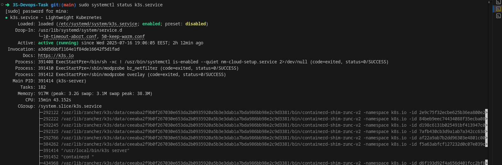
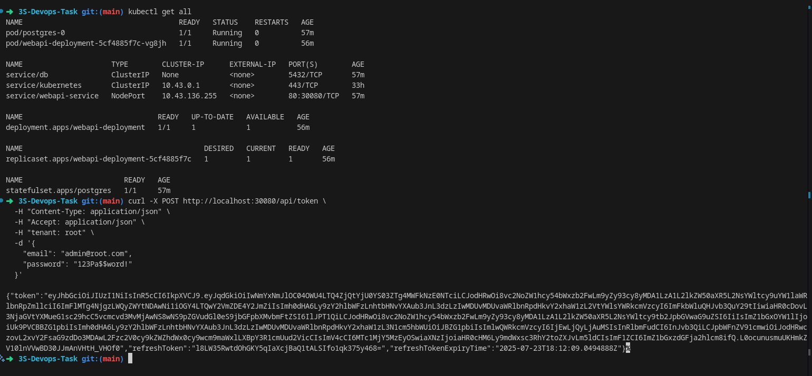
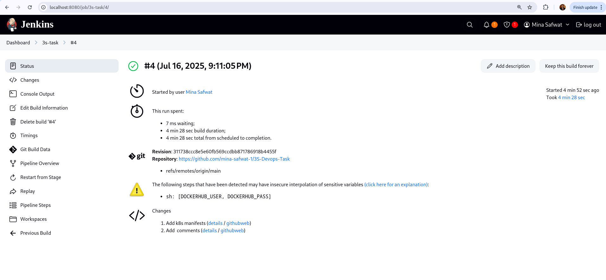
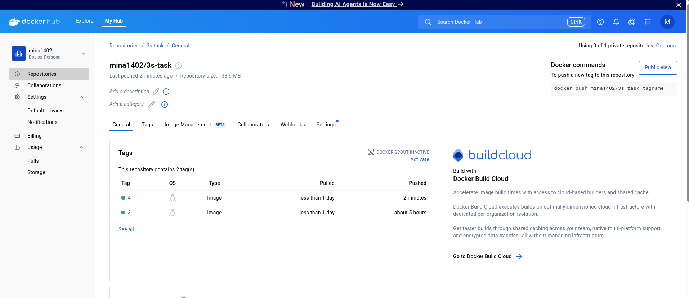
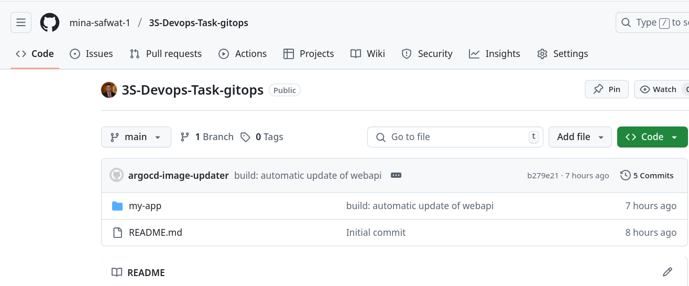
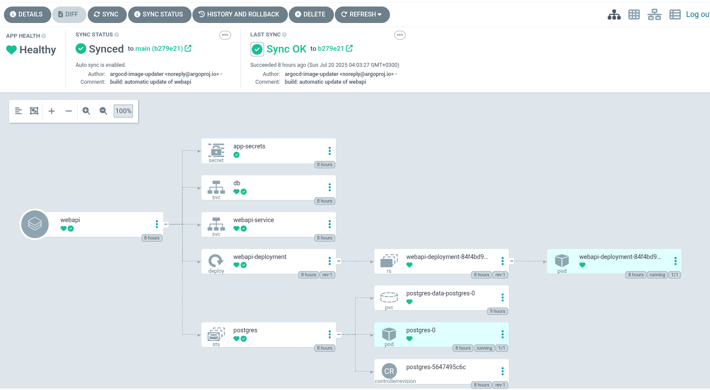
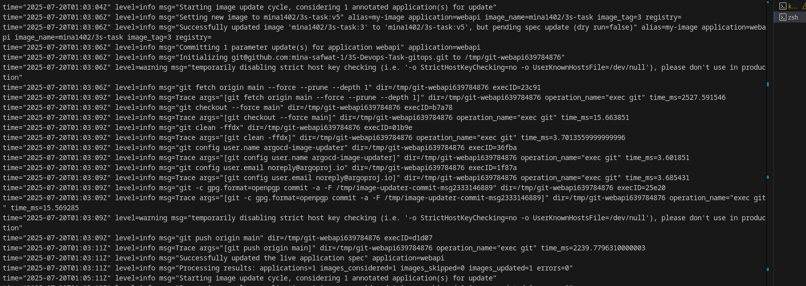
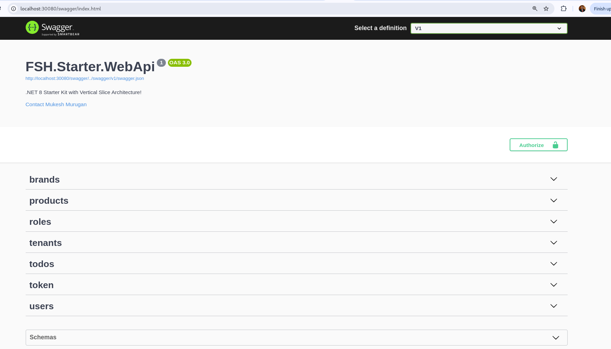

# 3S DevOps Task

This repository contains a complete DevOps project designed as part of the 3S DevOps technical assessment. It showcases a fully containerized .NET Web API deployed using Kubernetes with a CI/CD pipeline implemented through Jenkins. The system is configured with monitoring, logging, and persistent storage.

---

## 🛠️ Project Structure

```
3S-Devops-Task/
│
├── src/                       # Source code for the .NET Web API
│   └── api/
│       └── server/            # .NET 9 Web API project
│
├── Dockerfile                 # Dockerfile to containerize the Web API
├── docker-compose.yml         # Optional local Docker setup
├── Jenkinsfile                # Jenkins pipeline for CI/CD
├── k8s/                       # Kubernetes manifests for deployment
│   ├── DB_statefulset.yaml
│   ├── DB_service.yaml
│   ├── secret.yaml
│   ├── Server.yaml
│   └── Server_service.yaml
└── README.md                  # Project documentation
```

---

## ✅ Features

* ✅ .NET 9 Web API application
* ✅ Dockerized application with Dockerfile
* ✅ Jenkins CI pipeline:

  * Code checkout
  * Docker image build & push

* ✅ PostgreSQL via Kubernetes StatefulSet
* ✅ Persistent Volume Claims for database
* ✅ Use Kubernetes Secret to keep sensitive data (e.g., db_password)
* ✅ Local development via Docker Compose (optional)
* ✅ Helm Chart support for templated, configurable deployments
* ✅ GitOps-based CD with Argo CD
* ✅ Automated image tag updates via Argo CD Image Updater


---

## 🚀 Getting Started

### Prerequisites

* Docker & Docker Compose
* Kubernetes (K3s or Minikube recommended)
* kubectl
* Jenkins
* Git
* helm
* argocd + argocd image updater

---

### 🧪 Local Development (Docker Compose) for Testing

```bash
docker-compose up --build
```

---

### ☸️ Kubernetes Deployment

1. **Set up K3s (or your preferred Kubernetes distribution)**



2. **Apply manifests**

```bash
kubectl apply -f k8s/
```

3. **Check resources**

```bash
kubectl get all
```


---

### 🐳 Jenkins Pipeline

The Jenkins pipeline (in `Jenkinsfile`) handles:

* Building and tagging Docker images
* Pushing to Docker Hub

You’ll need to:

1. Set up a Jenkins with Docker access.
2. Store your Docker Hub credentials as Jenkins credentials.
3. Configure environment variables in Jenkins:

   * `DOCKER_IMAGE_NAME`
   * `DOCKER_IMAGE_TAG`



---

## 📦 Docker Image

* **Image Name**: `mina1402/3s-task`



---

## 🔐 Secrets & Configurations

Sensitive data such as PostgreSQL passwords are stored securely using Kubernetes `Secrets`:

```yaml
apiVersion: v1
kind: Secret
metadata:
  name: postgres-secret
type: Opaque
data:
  POSTGRES_PASSWORD: base64_encoded_password
```

## ⚙️ Helm Chart Deployment

This project includes support for deployment via **Helm**, a package manager for Kubernetes that simplifies application deployment and configuration.

### 📁 Helm Chart Structure

```
my-app/
  ├── Chart.yaml             # Helm chart metadata
  ├── values.yaml            # Default configuration values
  └── templates/             # Kubernetes manifest templates
      ├── deployment.yaml
      ├── service.yaml
      └── secret.yaml
```


### 📋 Helm Values

You can override default values using a custom `values.yaml` file:

```bash
helm install my-api ./helm/my-api -f custom-values.yaml
```


## 🚀 GitOps (CD)

This project uses **Argo CD** and **Argo CD Image Updater** to implement GitOps for Continuous Delivery.




### Argo CD Setup

* A separate **GitOps repo** contains Kubernetes manifests watched by Argo CD.
* Argo CD monitors the GitOps repo and automatically applies updates to the cluster when changes are detected.



### Argo CD Image Updater

* Automatically detects new image tags pushed to Docker Hub.
* Updates the container image field in the deployment YAML in the GitOps repo.
* This change is synced by Argo CD, redeploying the updated app.



#### Argo CD `Application`:

```yaml
apiVersion: argoproj.io/v1alpha1
kind: Application
metadata:
  name: webapi
  namespace: argocd
  annotations:
    # Argo CD Image Updater settings
    argocd-image-updater.argoproj.io/image-list: my-image=mina1402/3s-task
    argocd-image-updater.argoproj.io/my-image.update-strategy: newest-build
    argocd-image-updater.argoproj.io/my-image.allow-tags: regexp:^v.*
    argocd-image-updater.argoproj.io/my-image.helm.image-spec: image.spec
    argocd-image-updater.argoproj.io/write-back-method: git:secret:argocd/git-creds
    argocd-image-updater.argoproj.io/write-back-target: helmvalues:/my-app/values.yaml
    argocd-image-updater.argoproj.io/git-repository: git@github.com:mina-safwat-1/3S-Devops-Task-gitops.git
    argocd-image-updater.argoproj.io/git-branch: main
spec:
  project: default
  source:
    repoURL: https://github.com/mina-safwat-1/3S-Devops-Task-gitops
    targetRevision: main
    path: my-app
    helm:
      valueFiles:
        - values.yaml
  destination:
    server: https://kubernetes.default.svc
    namespace: default
  syncPolicy:
    automated:
      prune: true
      selfHeal: true
    syncOptions:
      - CreateNamespace=true

```

Absolutely! Here's a polished section you can **append to your README** to document your **Helm chart support**, assuming you're packaging your app with Helm:


## TESTING




## 🙌 Author

**Mina Safwat**
[GitHub Profile](https://github.com/mina-safwat-1)

---


